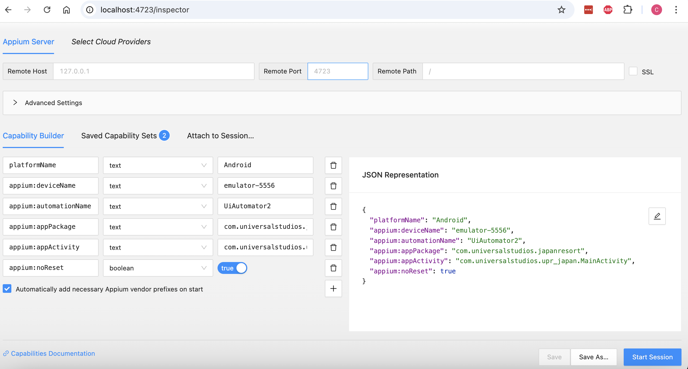

# Appium test for Android app
This is a UI automated test for Universal Studios Japan's (USJ from here on out) Android app, developed using Appium and
JavaScript. The app displays the wait times for each ride, and the test is designed to verify that 
this information appears correctly.  Currently, the test is written for the English version of 
the app and ensures that wait times are displayed as expected for each ride.

# Pre-requisite
* The app needs to be manually installed on the Android Emulator.

# Installation
I basically followed the [Official Appium documentation](https://appium.io/docs/en/2.5/quickstart/install/).
Following are some additional steps you need to take (which are not quite covered in the official doc).
* [Installing Homebrew](https://brew.sh/) is recommended.
* Install node by executing `brew install node` on the command line.
* Install Appium by executing `sudo npm install -g appium`.
* Install the Appium driver for Android by executing `appium driver install uiautomator2`.
* Create a project folder.
   1. CD into the folder.
   2. Run `npm init -y`.
   3. Run `npm install --save-dev @wdio/cli`.
   4. Run `npx wdio config`.
* Install the Assertion library [Chai](https://www.chaijs.com/) by executing `npm instal chai`.
* In order to look up the UI locators on the app, install Appium Inspector by executing  `appium plugin install --source=npm appium-inspector-plugin`.
* [Install Android Studio](https://developer.android.com/studio?gad_source=1&gad_campaignid=21831783525&gbraid=0AAAAAC-IOZkJYSDVzOOH-iUrP3ksxf12R&gclid=CjwKCAjwpMTCBhA-EiwA_-MsmWLeDRJSOm1xcrIP4FYRRmRfPkOWtQLL_8w9b83ZRGeJZ1PePM6vORoCV2kQAvD_BwE&gclsrc=aw.ds)

# Test Environment
Start up Android Studio and do the following:
1. On the menu go to Tool => Device Manager.
2. Select the Android model that you'd like to run the tests against.  Android emulator will appear on the right side of Android Studio.
3. Manually install the USJ app from PlayStore on the emulator.

# Test Execution
1. On terminal execute one of the following commands to start Appium:
* `appium` (when you just want to run the tests)
* `appium --use-plugins=inspector --allow-cors` (when you also want to run Appium inspector at the same time)
2. Open up another tab on the terminal, and run `node tests/usj_test.js`.

# How to use Appium inspector
1. On the terminal, execute `appium --use-plugins=inspector --allow-cors`.
2. Access http://localhost:4723/inspector on a web browser.  You can use the following JSON in order to look up the UI elements of the USJ app's first page:
   ```
   {
      "platformName": "Android",
      "appium:deviceName": "emulator-5556",
      "appium:automationName": "UiAutomator2",
      "appium:appPackage": "com.universalstudios.japanresort",
      "appium:appActivity": "com.universalstudios.upr_japan.MainActivity",
      "appium:noReset": true
   }
   ```
You should see something like this on your web browser:


* When you click **Start Session** on the bottom right corner, the app's first page will be shown on the left side, and the locators for the UI elements on the page will be shown on the right side.  The app's page here is not interactive.  If you want to look up the locators for other pages, you need to change the value for `appium:appActivity`.

# Explanation about the test
The JSON above is also in the test file `tests/usj_test.js` as following:
```
const capabilities = {
  platformName: 'Android',
  'appium:automationName': 'UiAutomator2',
  'appium:deviceName': 'Android',
  'appium:appPackage': 'com.universalstudios.japanresort',
  'appium:appActivity': 'com.universalstudios.upr_japan.MainActivity',
};
```
`appium:appPackage` is the app to launch, and `appium:appActivity` is which page to open when the test starts up.  In order to look up the values for these two properties,
1. Execute `adb devices` on the terminal.  Available emulators will be returned as following:
```
   List of devices attached
   emulator-5554	offline
   emulator-5556	device
```
2. On the Android emulator, manually navigate to the page for which you would like to look up the UI locators.
3. Execute `adb -s emulator-5556 shell dumpsys activity activities | grep "ResumedActivity"` on the terminal.  An output like following will be returned:
```
ResumedActivity: ActivityRecord{196591183 u0 com.universalstudios.japanresort/com.universalstudios.upr_japan.MainActivity t111}
```
In this case `com.universalstudios.japanresort` is the value for `appium:appPackage`, and `com.universalstudios.upr_japan.MainActivity` is the value for `appium:appActivity`.

# TODO
* Replace `driver.pause()` with other methods like `waitForExist()`.
* Make use of the Page Object Model.

