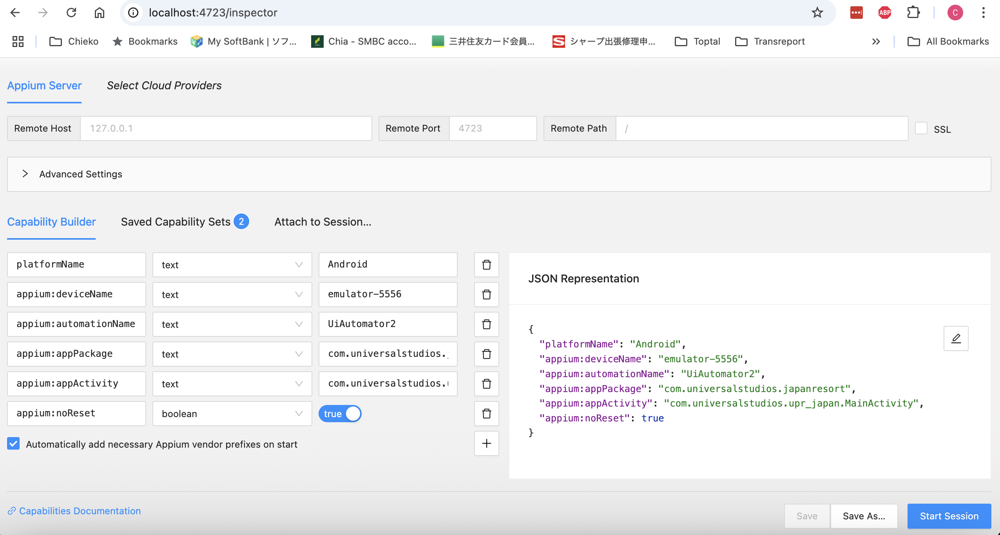

# appium_tests
これは、AppiumとJavaScriptを使った、USJのアンドロイドアプリ用（英語版）の自動テストで、Wait Time Show Shceuleのページで、それぞれのライドの待ち時間が表示されているかを確認します。

# 前提
* USJのアプリは、Emulator上のAndroidに手動でインストールする必要があります。
* テストは、Android Studioのエミュレータ上で実行されます。
* テストコードは、`tests/usj_test.js`に書かれています。

# インストール
注：基本的には、[Appiumのオフィシャルドキュメンテーション](https://appium.io/docs/ja/latest/quickstart/install/) に沿って下さい。
* まず[Home brewをインストール](https://brew.sh/ja/) することをおすすめします。
* コマンド`brew install node`を実行し、nodeとnpmをインストールします。
* コマンド`sudo npm install -g appium` を実行し、Appiumをインストールします。
* アンドロイド用のAppiumドライバー、[UiAutomator2](https://appium.io/docs/ja/latest/quickstart/uiauto2-driver/)を、コマンド `appium driver install uiautomator2` を実行し、インストールします（オフィシャルドキュメンテーションは、英語版しかないようです）。
* アサーションライブラリー、[Chai](https://www.chaijs.com/) を、コマンド `npm instal chai`を実行し、インストールします。
* アプリ上のUIロケーターを表示してくれるツール、Appium inspectorを、コマンド `appium plugin install --source=npm appium-inspector-plugin`を実行して、インストールします。
* [Android Studioをインストール](https://developer.android.com/studio/install?hl=ja) します。

# 設定
* Android Studioを立ち上げ、メニューのツール =>　デバイスマネージャーを開き、Androidの機種を選択。Android Studioの右手側に、Androidエミュレータが表示されます。
* PlayStoreから、USJのアプリをインストールします。
 
# テスト実行
1. コマンドラインで次のうち、どれかを実行
*  `appium` （ただテストを実行したい時）
*  `appium --use-plugins=inspector --allow-cors` （テストを実行すると同時に、デバグの為などにAppium inspectorも使いたい時）

2. コマンドラインの別のタブで`node tests/usj_test.js` を実行すると、このようにテストが実行されます。
   [▶ Download or watch video](https://github.com/c-higashi/appium_tests/blob/main/resources/test_execution.mov)


# Appium inspectorの使い方
1. コマンドラインで`appium --use-plugins=inspector --allow-cors`を実行
2. ブラウザでhttp://localhost:4723/inspector へアクセス。このUSJアプリのUIエレメントのロケーターを調べるためには、以下のJSONをお使い下さい。
```
{
  "platformName": "Android",
  "appium:deviceName": "emulator-5556",
  "appium:automationName": "UiAutomator2",
  "appium:appPackage": "com.universalstudios.japanresort",
  "appium:appActivity": "com.universalstudios.upr_japan.MainActivity",
  "appium:noReset": true
}
```
ページ上では、こういう風になります。


* この設定でインスペクターページの右下の`Start Session`をクリックすると、ページの左側にアプリの最初のページが表示され、右側にそれぞれのUIエレメントのロケーターが表示されます。このページで、アプリの別のページに行ったりすることは、出来ません。
* 別のページのロケーターを調べたい時は、上記のJSONの`appium:appActivity`の値を変える必要があります。この値の調べ方は、以下で説明します。

# テストについて
上記のJSONは、`tests/usj_test.js`のテストコードの最初の方にも以下のように出てきます。
```
const capabilities = {
  platformName: 'Android',
  'appium:automationName': 'UiAutomator2',
  'appium:deviceName': 'Android',
  'appium:appPackage': 'com.universalstudios.japanresort',
  'appium:appActivity': 'com.universalstudios.upr_japan.MainActivity',
};
```
`appium:appPackage`が起動するアプリで、`appium:appActivity`がどのページからテストを開始するかを定めます。この二つの値を調べるには、
1. コマンド`adb devices`を実行。以下のようにエミュレータが記載されます。
   ```
   List of devices attached
   emulator-5554	offline
   emulator-5556	device
   ```
2. Androidエミュレータでアプリを立ち上げます、この二つの値を調べたい画面まで進みます。
3. コマンド`adb -s emulator-5556 shell dumpsys activity activities | grep "ResumedActivity"`を実行します。以下のようなアウトプットが出ます。
`ResumedActivity: ActivityRecord{196591183 u0 com.universalstudios.japanresort/com.universalstudios.upr_japan.MainActivity t111}`

この場合、`appium:appPackage`の値が`com.universalstudios.japanresort`、`appium:appActivity`が`com.universalstudios.upr_japan.MainActivity`となります。

# 今後の課題
1. テストの最初で言語を日本語に設定し、アプリを起動
2. アサーションを日本語で実行


